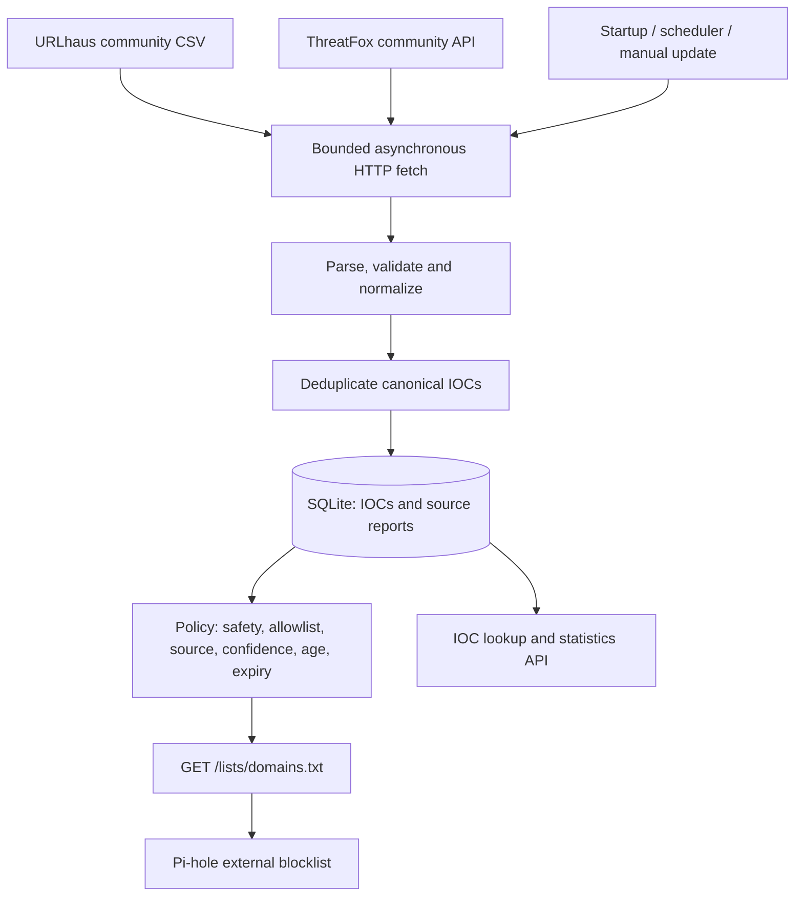

# Cerberus-TI

A small, self-hosted threat-intelligence authority for a homelab. It collects URLhaus and ThreatFox evidence, correlates normalized indicators in SQLite, and publishes a conservative exact-host DNS blocklist. Pi-hole consumes the output; the intelligence core is independent of Pi-hole.

Milestone 1 is implemented. Python 3.12+ is required. No dashboard or authentication is included.

## Architecture



| Module | Responsibility |
| --- | --- |
| `app/config.py` | Validated YAML and environment overrides |
| `app/database.py`, `app/models.py` | WAL, transactions, IOCs, source observations, provider state |
| `app/normalization.py` | Strict IDNA hostname and IP normalization, URL-host extraction, safety |
| `app/feeds/` | Provider interface, bounded HTTP, URLhaus and ThreatFox adapters |
| `app/services/ingestion.py` | Atomic batches, deduplication, job ownership and cooldowns |
| `app/policy.py`, `app/services/blocklist.py` | Current decisions and sorted domain export |
| `app/api/routes.py`, `app/schemas.py` | Health, lookup, inventory, statistics and updates |
| `app/main.py`, `app/scheduler.py` | Lifespan and APScheduler |
| `tests/` | Offline unit and integration tests |

One normalized value has one IOC row; domain and hostname classifications share that identity. Observations are unique by `(ioc_id, source, external_id)`. Different URLs/reports from the same source retain their own confidence, status, timestamps and metadata. Repeated downloads update an observation. Source reports retain first/latest evidence and the latest snapshot, not an append-only audit of every response. Expired intelligence is never deleted automatically.

IOC `active`, `blocked`, reasons and aggregate expiration are computed at read time. Active means at least one active, unexpired report, not necessarily eligible to block. Confidence stays on each observation, with no invented aggregate score. Source evidence timestamps and `fetched_at` are separate.

## Credentials and supported feeds

Obtain keys through the [abuse.ch authentication portal](https://auth.abuse.ch/) and follow each service's access and fair-use requirements. Use process environment variables or an untracked `.env`:

```dotenv
URLHAUS_AUTH_KEY=your-urlhaus-auth-key
THREATFOX_AUTH_KEY=your-threatfox-auth-key
```

The same account key may work for both, depending on access. Missing keys do not prevent startup: updates record `missing_api_key` and continue. A new database produces an empty blocklist until an eligible import succeeds.

- [URLhaus official documentation](https://urlhaus.abuse.ch/api/): downloads the documented v2 `recent.csv` export, which requires a key in its path. Parses the nine-column layout: ID, added time, URL, status, last online, threat, tags, reference, reporter. Only online reports can qualify. Confidence remains null. Hosts are extracted without visiting URLs or expanding to parent domains. This is raw URL evidence, not the separately curated RPZ export.
- [ThreatFox official documentation](https://threatfox.abuse.ch/api/): authenticated POST to `get_iocs`, requesting seven days by default. Supports domain, hostname, URL, IP, IPv4, IPv6 and IP:port reports; ports remain metadata. Hashes are counted as ignored. The recent window is based on first-seen time and does not provide a full historical synchronization.

Only the two fixed HTTPS endpoints are contacted. Redirects and environment proxy inheritance are disabled. IOC/reference URLs are never fetched. There is no arbitrary URL fetch endpoint; proxy support would require an explicit future design.

## Docker deployment

Install Docker Engine/Desktop with Compose. From the project directory:

```sh
cp .env.example .env
# Edit .env: set keys and CERBERUS_BIND_IP to the host's homelab IPv4 address.
docker compose config --quiet
docker compose up -d --build
docker compose logs -f --tail=100 cerberus-ti
```

In PowerShell, use `Copy-Item .env.example .env` for the first command. For a host at `192.168.1.10`, add `CERBERUS_BIND_IP=192.168.1.10` to `.env`. The default binding is localhost, which a remote Pi-hole cannot reach. A deliberate `0.0.0.0` binding is possible; restrict access with your firewall.

The container runs as UID/GID 10001, with a read-only application filesystem and a named volume at `/data`; SQLite persists at `/data/cerberus.db`. Configuration is mounted read-only. Runtime dependencies are pinned in `requirements.lock`. Capabilities are dropped, logs rotate, and an HTTP healthcheck is included. Docker initializes a new named volume with the image directory ownership. Existing or host-mounted data directories must be writable by UID 10001.

Stop with `docker compose down`; do not add `-v` unless deleting the database is intended. After YAML/key changes run `docker compose up -d --force-recreate`. Use one replica and one Uvicorn worker.

## Running locally

PowerShell, from the repository:

```powershell
python -m venv .venv
.\.venv\Scripts\python -m pip install -r requirements.lock
Copy-Item .env.example .env
# Edit .env with your keys.
.\.venv\Scripts\python -m uvicorn app.main:app --host 0.0.0.0 --port 8080 --workers 1
```

Linux/macOS:

```sh
python3 -m venv .venv
.venv/bin/python -m pip install -r requirements.lock
cp .env.example .env
# Edit .env with your keys.
.venv/bin/python -m uvicorn app.main:app --host 0.0.0.0 --port 8080 --workers 1
```

Local storage defaults to `./data/cerberus.db`. Run from the project root or specify `CERBERUS_CONFIG`. **Use one service process:** the overlap guard is process-local, and each worker would start its own scheduler. Normal operation does not require reload mode.

## Configuration and policy

Ordinary settings live in `config.yaml`; unknown settings and invalid bounds fail startup. Credentials are environment-only. `.env` fills absent variables; existing process variables take precedence.

| Environment variable | Override |
| --- | --- |
| `CERBERUS_CONFIG` | YAML path, default `config.yaml` |
| `CERBERUS_DATABASE_URL` | SQLite URL; Compose sets the persistent `/data` location |
| `CERBERUS_UPDATE_INTERVAL_MINUTES` | Interval, minimum five minutes |
| `CERBERUS_SCHEDULER_ENABLED` | Periodic scheduling enabled/disabled |
| `CERBERUS_UPDATE_ON_START` | Startup update, independent of periodic scheduling |
| `CERBERUS_LOG_LEVEL` | DEBUG, INFO, WARNING or ERROR |
| `CERBERUS_BIND_IP` | Compose port binding only |

Compose explicitly forwards credentials and database location. Edit YAML for other container settings, or add chosen overrides to Compose's environment mapping. Avoid sharing expanded `docker compose config` output because it substitutes keys; validate with `--quiet`.

Default policy requires:

1. A valid domain/hostname without a safety exclusion. IPs are stored but never exported.
2. No allowlist match, including parent-domain entries.
3. At least one individually qualifying observation from an enabled provider and policy source.
4. Active, unexpired evidence seen less than seven days ago.
5. ThreatFox confidence at least 80. Missing ThreatFox confidence is rejected. URLhaus explicitly permits unknown confidence but requires online evidence, without fabricating a number.

Confidence and freshness must come from the **same observation**. Old high-confidence evidence cannot borrow freshness from a new low-confidence report. Expiration defaults to source last-seen plus seven days; missing last-seen falls back to source first-seen. Downloading unchanged old evidence never renews it. Disappearance from a rolling feed is not confirmed retraction: existing evidence ages out. Received offline URLhaus reports deactivate their corresponding observations.

Expiry is reevaluated on every request, including during outages. Shortening configured TTL tightens policy after restart; stored expiration remains an upper bound. Extending TTL requires refreshed ingestion. IOC `expires_at` is the maximum stored report expiration; use `policy_reasons` for the actual decision.

```yaml
allowlist:
  domains:
    - example.com
    - internal.example
```

Entries protect exact names and all subdomains using label boundaries: `example.com` protects `a.example.com`, not `notexample.com`. Restart after editing.

Private, loopback, link-local, multicast, reserved, non-global and unspecified IPs never qualify. Single-label/malformed names are rejected. Policy excludes `.localhost`, `.local`, `.localdomain`, `.internal`, `.lan`, `.home`, `.home.arpa`, `.invalid`, `.test` and `.onion`. Internal whitespace is rejected instead of joining labels; IDNs use validated punycode. No DNS resolution occurs, so public-looking hostnames resolving privately cannot be detected. Allowlist homelab names explicitly.

Blocking a hostname affects all URLs on it. Shared hosting and compromised legitimate sites can cause false positives. Allowlist critical services and review output. This version has no public-suffix or popular-domain dataset.

## API and operation

| Endpoint | Result |
| --- | --- |
| `GET /health` | Database readiness; does not imply feed health |
| `GET /lists/domains.txt` | Sorted, deduplicated exact names, one per line, no comments |
| `GET /api/stats` | Counts, source successes/failures, cooldowns and current/latest job |
| `GET /api/iocs?limit=100&offset=0` | Inventory; max page size 500; optional `ioc_type` filter |
| `GET /api/iocs/evil.example` | Evidence, metadata, source eligibility and policy reasons |
| `POST /api/update` | 202 accepted; 409 while running; inspect stats for completion |
| `GET /docs` | Interactive API documentation |

Updates run at startup and every 60 minutes by default. All triggers share one task owner. Each source has a persisted five-minute minimum cooldown, including across restarts. HTTP 429 honors numeric or HTTP-date Retry-After, bounded between five minutes and seven days. Later scheduled/manual updates retry when eligible; there is no immediate retry loop. A cooldown can make an accepted manual job skip providers. Failures leave historical data intact and do not prevent other providers from updating. Each database batch commits atomically.

Default bounds: 50 MiB per response, 200,000 rows, 30-second HTTP operation timeout, 120-second total download deadline. Compressed responses are rejected to avoid decompression bombs. Parsers and database writes run outside the event loop. Logs use aggregate counts and safe error codes, never raw exceptions, keys or individual IOCs. Shutdown allows an in-flight update to finish; Compose grants five minutes for the default workload. Monitor retained history's disk usage.

SQLite uses WAL, foreign keys, busy timeout and per-provider transactions. Idempotent SQLAlchemy `create_all` initializes this first schema; it is not a migration system. Future schema changes should introduce versioned migrations. For simple consistent backups, stop the service and copy the full data directory/volume. For online backups, use SQLite's backup API; do not copy only the live `.db` while ignoring WAL.

## Pi-hole integration

Subscribe to this URL, replacing the host with your Cerberus address:

```text
http://<cerberus-host>:8080/lists/domains.txt
```

In Pi-hole's administration interface, add it as a subscribed blocking list (Lists/Adlists, depending on version), enable it for intended client groups, then update Gravity. Verify Pi-hole can reach port 8080. See the [Pi-hole Gravity documentation](https://docs.pi-hole.net/database/gravity/). Cerberus never opens or modifies Pi-hole's internal database.

Pi-hole uses its downloaded Gravity snapshot: additions, expirations and allowlist changes take effect there only after Gravity refreshes. Schedule appropriate refreshes on Pi-hole; Cerberus does not trigger them. Entries are exact names, without automatic parent-domain or wildcard expansion. A prolonged source outage eventually produces an empty list as evidence expires.

## Tests

```powershell
.\.venv\Scripts\python -m pip install -r requirements-dev.txt -c requirements.lock
.\.venv\Scripts\python -m pytest -q
.\.venv\Scripts\ruff check app tests
.\.venv\Scripts\ruff format --check app tests
.\.venv\Scripts\python -m compileall -q app
.\.venv\Scripts\python -m pip check
```

On Linux use `.venv/bin/python` and `.venv/bin/ruff`. Tests use mock transports and block real HTTP transports. They need no credentials or live feed access, and cover normalization, safety, allowlists, expiry, deduplication, attribution, policy, rollback, rate limits, outages, overlap and complete API output. `requirements.txt` defines supported bounds; `requirements.lock` pins tested runtime versions. Re-resolve and retest deliberately when upgrading.

## Security and limitations

This release is internal-only. The API, including manual updates and metadata, has no authentication. Keep it off the public Internet; use network restrictions or an authenticated reverse proxy. Future authentication can attach to the separate `/api` router. Clients must escape hostile metadata and should not automatically follow indicator links.

No keys are shipped. `.env` and databases are Git-ignored and excluded from the Docker build. HTTP wire logging is disabled because URLhaus embeds credentials in the export URL. Do not enable external HTTP tracing with real keys. Environment secrets remain visible to host/container administrators.

Milestone 1 supports one process, SQLite, recent feed windows, current per-report snapshots and exact-host export. Full historical backfill, append-only event history, automatic feed schema negotiation and large-scale indexed policy/search are future work. Live credentialed compatibility cannot be verified without keys; fixtures follow published schemas. Docker runtime verification requires Docker on the deployment host.

## Roadmap (not implemented)

- **Milestone 2:** AbuseIPDB, improved scoring/correlation, richer search, source health monitoring and manual allow/block overrides.
- **Milestone 3:** Dashboard, IOC investigation, graphs and feed management.
- **Milestone 4:** MikroTik, optional malicious-IP lists, strict safety thresholds, dry-run mode and automatic expiration/removal.
- **Milestone 5:** Wazuh, contact alerts and IOC matching against homelab telemetry.
