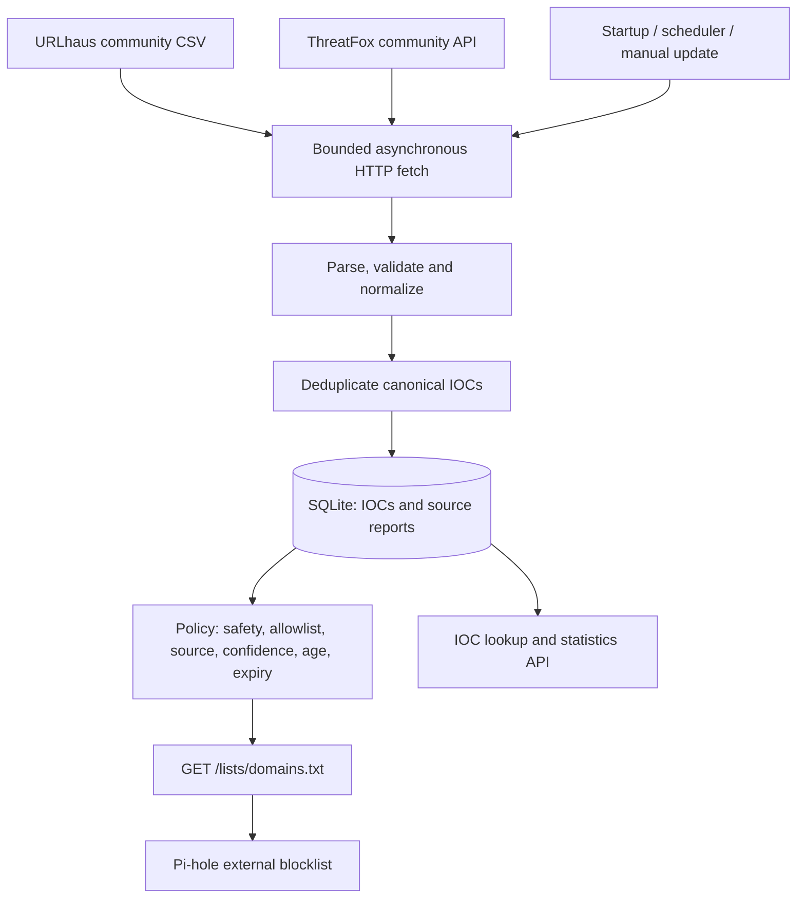
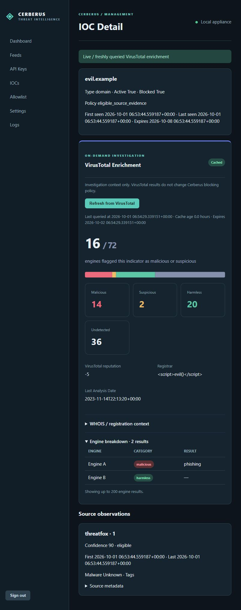

# Cerberus-TI

A small, self-hosted threat-intelligence authority for a homelab. It collects URLhaus and ThreatFox evidence, correlates normalized indicators in SQLite, and publishes a conservative exact-host DNS blocklist. Pi-hole consumes the output; the intelligence core is independent of Pi-hole.

Milestone 1 intelligence remains intact. The FastAPI management dashboard is available at `/admin`. Python 3.12+ is required.

## Architecture



| Module | Responsibility |
| --- | --- |
| `app/config.py` | Validated YAML and environment overrides |
| `app/database.py`, `app/models.py` | WAL, transactions, IOCs, source observations, provider state |
| `app/normalization.py` | Strict IDNA hostname and IP normalization, URL-host extraction, safety |
| `app/feeds/` | Provider interface, bounded HTTP, URLhaus and ThreatFox adapters |
| `app/services/ingestion.py` | Atomic batches, deduplication, job ownership and cooldowns |
| `app/policy.py`, `app/services/blocklist.py` | Current decisions and sorted domain export |
| `app/api/routes.py`, `app/schemas.py` | Health, lookup, inventory, statistics and updates |
| `app/main.py`, `app/scheduler.py` | Lifespan and APScheduler |
| `tests/` | Offline unit and integration tests |

One normalized value has one IOC row; domain and hostname classifications share that identity. Observations are unique by `(ioc_id, source, external_id)`. Different URLs/reports from the same source retain their own confidence, status, timestamps and metadata. Repeated downloads update an observation. Source reports retain first/latest evidence and the latest snapshot, not an append-only audit of every response. Expired intelligence is never deleted automatically.

IOC `active`, `blocked`, reasons and aggregate expiration are computed at read time. Active means at least one active, unexpired report, not necessarily eligible to block. Confidence stays on each observation, with no invented aggregate score. Source evidence timestamps and `fetched_at` are separate.

## Credentials and supported feeds

Obtain keys through the [abuse.ch authentication portal](https://auth.abuse.ch/) and follow each service's access and fair-use requirements. Use process environment variables or an untracked `.env`:

```dotenv
URLHAUS_AUTH_KEY=your-urlhaus-auth-key
THREATFOX_AUTH_KEY=your-threatfox-auth-key
```

The same account key may work for both, depending on access. Missing keys do not prevent startup: updates record `missing_api_key` and continue. A new database produces an empty blocklist until an eligible import succeeds.

- [URLhaus official documentation](https://urlhaus.abuse.ch/api/): downloads the documented v2 `recent.csv` export, which requires a key in its path. Parses the nine-column layout: ID, added time, URL, status, last online, threat, tags, reference, reporter. Only online reports can qualify. Confidence remains null. Hosts are extracted without visiting URLs or expanding to parent domains. This is raw URL evidence, not the separately curated RPZ export.
- [ThreatFox official documentation](https://threatfox.abuse.ch/api/): authenticated POST to `get_iocs`, requesting seven days by default. Supports domain, hostname, URL, IP, IPv4, IPv6 and IP:port reports; ports remain metadata. Hashes are counted as ignored. The recent window is based on first-seen time and does not provide a full historical synchronization.

Only the two fixed HTTPS endpoints are contacted. Redirects and environment proxy inheritance are disabled. IOC/reference URLs are never fetched. There is no arbitrary URL fetch endpoint; proxy support would require an explicit future design.

## Docker deployment

Install Docker Engine/Desktop with Compose. From the project directory:

```sh
cp .env.example .env
# Edit .env: set keys and CERBERUS_BIND_IP to the host's homelab IPv4 address.
docker compose config --quiet
docker compose up -d --build
docker compose logs -f --tail=100 cerberus-ti
```

In PowerShell, use `Copy-Item .env.example .env` for the first command. For a host at `192.168.1.10`, add `CERBERUS_BIND_IP=192.168.1.10` to `.env`. The default binding is localhost, which a remote Pi-hole cannot reach. A deliberate `0.0.0.0` binding is possible; restrict access with your firewall.

The container runs as UID/GID 10001, with a read-only application filesystem and a named volume at `/data`; SQLite persists at `/data/cerberus.db`. Configuration is mounted read-only. Runtime dependencies are pinned in `requirements.lock`. Capabilities are dropped, logs rotate, and an HTTP healthcheck is included. Docker initializes a new named volume with the image directory ownership. Existing or host-mounted data directories must be writable by UID 10001.

Stop with `docker compose down`; do not add `-v` unless deleting the database is intended. After YAML or environment-key changes run `docker compose up -d --force-recreate`; dashboard-managed keys reload at runtime. Use one replica and one Uvicorn worker.

### Fedora / SELinux deployment

Keep SELinux enabled. Unix permissions such as `0644` can allow reading while
SELinux still denies the container access, producing `PermissionError` for
`config.yaml`. The config bind mount uses `./config.yaml:/app/config.yaml:ro,Z`:
`ro` keeps it read-only inside the container, and `Z` asks Docker to relabel the
host file for this container's private SELinux access. Lowercase `z` instead
labels content for sharing between containers; use it only for deliberately
shared bind mounts. Relabel only dedicated Cerberus paths, not broad host or
system directories.

The comma-separated short mount syntax is supported by Docker Compose and avoids
depending on newer long-form `bind.selinux` support. The SELinux option is ignored
on platforms without SELinux, so the same file works on Ubuntu/Debian hosts and
Docker Desktop with Linux containers (allow the project path in Desktop's file
sharing settings if required). See the [Compose mount reference](https://docs.docker.com/reference/compose-file/services/#short-syntax-5).
These instructions use local `docker compose`, not Swarm `docker stack deploy`.
Ensure `config.yaml` exists as a regular file before starting: short bind syntax
can create a directory if the source is missing.

`/data` uses the existing `cerberus-data` named volume, managed and labeled by
Docker; it needs no host bind relabel option. It remains writable by UID/GID
10001 and persists SQLite, encrypted provider credentials, administrator records,
and dashboard settings across rebuilds and container recreation. Keep the same
Compose project name/directory to reuse that volume, and retain the existing
`CERBERUS_SECRET_KEY` in `.env` to decrypt credentials. Do not delete the volume
or run `docker compose down -v` when applying this fix.

If you deliberately replace the named volume with a dedicated host directory,
use `./data:/data:rw,Z` and ensure its Unix ownership permits UID/GID 10001 to
write (account for UID mapping with rootless Docker). Relabeling does not fix Unix
ownership. Do not switch an existing deployment's storage path without migrating
the complete stopped data volume, including SQLite WAL files. Any additional
dedicated host bind mounts should likewise use `:ro,Z` or `:rw,Z` as appropriate.
The `/tmp` tmpfs has no host path to relabel.

Apply this mount-only change from the existing project directory:

```sh
test -f config.yaml
docker compose config --quiet
docker compose up -d --no-build --force-recreate cerberus-ti
docker compose ps
docker compose logs --tail=100 cerberus-ti
```

Only container recreation is required; rebuilding the image or using
`docker compose restart` does not apply new mount options.

For permission-denied mount failures on Fedora, inspect labels and recent denials:

```sh
getenforce
ls -lZ config.yaml
docker info --format '{{json .SecurityOptions}}'
docker inspect "$(docker compose ps -aq cerberus-ti)" --format '{{json .Mounts}}'
sudo ausearch -m AVC,USER_AVC -ts recent
# Only when using the optional host data bind mount:
ls -ldZ data
```

Confirm the config mount is read-only and `/data` is writable. Once startup works,
check access as the existing non-root application user:

```sh
docker compose exec cerberus-ti id
docker compose exec cerberus-ti python -c 'from pathlib import Path; import tempfile; Path("/app/config.yaml").read_bytes(); f = tempfile.TemporaryFile(dir="/data"); f.close(); print("config readable; /data writable")'
```

If denials remain, check Docker's SELinux support and the source filesystem's
label support using the commands above. Do not use `chmod 777`, privileged mode,
a root application user, or disabling SELinux as a workaround. Avoid sharing
expanded `docker compose config` output because it includes environment secrets.

## Running locally

PowerShell, from the repository:

```powershell
python -m venv .venv
.\.venv\Scripts\python -m pip install -r requirements.lock
Copy-Item .env.example .env
# Edit .env with your keys.
.\.venv\Scripts\python -m uvicorn app.main:app --host 0.0.0.0 --port 8080 --workers 1
```

Linux/macOS:

```sh
python3 -m venv .venv
.venv/bin/python -m pip install -r requirements.lock
cp .env.example .env
# Edit .env with your keys.
.venv/bin/python -m uvicorn app.main:app --host 0.0.0.0 --port 8080 --workers 1
```

Local storage defaults to `./data/cerberus.db`. Run from the project root or specify `CERBERUS_CONFIG`. **Use one service process:** the overlap guard is process-local, and each worker would start its own scheduler. Normal operation does not require reload mode.

## Configuration and policy

Ordinary settings live in `config.yaml`; unknown settings and invalid bounds fail startup. Credentials can be stored encrypted through the dashboard. Database-managed keys take precedence over environment keys; `.env` fills absent variables. Existing process variables take precedence over `.env`.

| Environment variable | Override |
| --- | --- |
| `CERBERUS_CONFIG` | YAML path, default `config.yaml` |
| `CERBERUS_DATABASE_URL` | SQLite URL; Compose sets the persistent `/data` location |
| `CERBERUS_UPDATE_INTERVAL_MINUTES` | Interval, minimum five minutes |
| `CERBERUS_SCHEDULER_ENABLED` | Periodic scheduling enabled/disabled |
| `CERBERUS_UPDATE_ON_START` | Startup update, independent of periodic scheduling |
| `CERBERUS_LOG_LEVEL` | DEBUG, INFO, WARNING or ERROR |
| `CERBERUS_BIND_IP` | Compose port binding only |

Compose explicitly forwards credentials and database location. Edit YAML for other container settings, or add chosen overrides to Compose's environment mapping. Avoid sharing expanded `docker compose config` output because it substitutes keys; validate with `--quiet`.

Default policy requires:

1. A valid domain/hostname without a safety exclusion. IPs are stored but never exported.
2. No allowlist match, including parent-domain entries.
3. At least one individually qualifying observation from an enabled provider and policy source.
4. Active, unexpired evidence seen less than seven days ago.
5. ThreatFox confidence at least 80. Missing ThreatFox confidence is rejected. URLhaus explicitly permits unknown confidence but requires online evidence, without fabricating a number.

Confidence and freshness must come from the **same observation**. Old high-confidence evidence cannot borrow freshness from a new low-confidence report. Expiration defaults to source last-seen plus seven days; missing last-seen falls back to source first-seen. Downloading unchanged old evidence never renews it. Disappearance from a rolling feed is not confirmed retraction: existing evidence ages out. Received offline URLhaus reports deactivate their corresponding observations.

Expiry is reevaluated on every request, including during outages. Shortening configured TTL tightens policy after restart; stored expiration remains an upper bound. Extending TTL requires refreshed ingestion. IOC `expires_at` is the maximum stored report expiration; use `policy_reasons` for the actual decision.

```yaml
allowlist:
  domains:
    - example.com
    - internal.example
```

Entries protect exact names and all subdomains using label boundaries: `example.com` protects `a.example.com`, not `notexample.com`. Restart after editing.

Private, loopback, link-local, multicast, reserved, non-global and unspecified IPs never qualify. Single-label/malformed names are rejected. Policy excludes `.localhost`, `.local`, `.localdomain`, `.internal`, `.lan`, `.home`, `.home.arpa`, `.invalid`, `.test` and `.onion`. Internal whitespace is rejected instead of joining labels; IDNs use validated punycode. No DNS resolution occurs, so public-looking hostnames resolving privately cannot be detected. Allowlist homelab names explicitly.

Blocking a hostname affects all URLs on it. Shared hosting and compromised legitimate sites can cause false positives. Allowlist critical services and review output. This version has no public-suffix or popular-domain dataset.

## API and operation

| Endpoint | Result |
| --- | --- |
| `GET /health` | Database readiness; does not imply feed health |
| `GET /lists/domains.txt` | Sorted, deduplicated exact names, one per line, no comments |
| `GET /api/stats` | Counts, source successes/failures, cooldowns and current/latest job |
| `GET /api/iocs?limit=100&offset=0` | Inventory; max page size 500; optional `ioc_type` filter |
| `GET /api/iocs/evil.example` | Evidence, metadata, source eligibility and policy reasons |
| `POST /api/update` | 202 accepted; 409 while running; inspect stats for completion |
| `GET /docs` | Interactive API documentation |

Updates run at startup and every 60 minutes by default. All triggers share one task owner. Each source has a persisted five-minute minimum cooldown, including across restarts. HTTP 429 honors numeric or HTTP-date Retry-After, bounded between five minutes and seven days. Later scheduled/manual updates retry when eligible; there is no immediate retry loop. A cooldown can make an accepted manual job skip providers. Failures leave historical data intact and do not prevent other providers from updating. Each database batch commits atomically.

Default bounds: 50 MiB per response, 200,000 rows, 30-second HTTP operation timeout, 120-second total download deadline. Compressed responses are rejected to avoid decompression bombs. Parsers and database writes run outside the event loop. Logs use aggregate counts and safe error codes, never raw exceptions, keys or individual IOCs. Shutdown allows an in-flight update to finish; Compose grants five minutes for the default workload. Monitor retained history's disk usage.

SQLite uses WAL, foreign keys, busy timeout and per-provider transactions. Startup applies the additive version 2 schema and records `schema_version=2`; existing IOC tables and data are preserved. Back up the database before upgrades. For simple consistent backups, stop the service and copy the full data directory/volume. For online backups, use SQLite's backup API; do not copy only the live `.db` while ignoring WAL.

## Pi-hole integration

Subscribe to this URL, replacing the host with your Cerberus address:

```text
http://<cerberus-host>:8080/lists/domains.txt
```

In Pi-hole's administration interface, add it as a subscribed blocking list (Lists/Adlists, depending on version), enable it for intended client groups, then update Gravity. Verify Pi-hole can reach port 8080. See the [Pi-hole Gravity documentation](https://docs.pi-hole.net/database/gravity/). Cerberus never opens or modifies Pi-hole's internal database.

Pi-hole uses its downloaded Gravity snapshot: additions, expirations and allowlist changes take effect there only after Gravity refreshes. Schedule appropriate refreshes on Pi-hole; Cerberus does not trigger them. Entries are exact names, without automatic parent-domain or wildcard expansion. A prolonged source outage eventually produces an empty list as evidence expires.

## Tests

```powershell
.\.venv\Scripts\python -m pip install -r requirements-dev.txt -c requirements.lock
.\.venv\Scripts\python -m pytest -q
.\.venv\Scripts\ruff check app tests
.\.venv\Scripts\ruff format --check app tests
.\.venv\Scripts\python -m compileall -q app
.\.venv\Scripts\python -m pip check
```

On Linux use `.venv/bin/python` and `.venv/bin/ruff`. Tests use mock transports and block real HTTP transports. They need no credentials or live feed access, and cover normalization, safety, allowlists, expiry, deduplication, attribution, policy, rollback, rate limits, outages, overlap and complete API output. `requirements.txt` defines supported bounds; `requirements.lock` pins tested runtime versions. Re-resolve and retest deliberately when upgrading.

## Security and limitations

This release is internal-only. The management UI and manual update route require a local administrator session and CSRF token. Existing read-only `/api/stats` and `/api/iocs` remain LAN-only. Keep it off the public Internet; use network restrictions or an authenticated reverse proxy. Clients must escape hostile metadata and should not automatically follow indicator links.

No keys are shipped. `.env` and databases are Git-ignored and excluded from the Docker build. HTTP wire logging is disabled because URLhaus embeds credentials in the export URL. Do not enable external HTTP tracing with real keys. Environment secrets remain visible to host/container administrators.

Milestone 1 supports one process, SQLite, recent feed windows, current per-report snapshots and exact-host export. Full historical backfill, append-only event history, automatic feed schema negotiation and large-scale indexed policy/search are future work. Live credentialed compatibility cannot be verified without keys; fixtures follow published schemas. Docker runtime verification requires Docker on the deployment host.

## Management dashboard

Open `http://<cerberus-host>:8080/admin` on a trusted management LAN. The dark interface has Dashboard, Feeds, API Keys, IOCs, Allowlist, Settings, and Logs pages. It works without external fonts, scripts, or a CDN. The dashboard shows job state, feed health, inventory totals, and an Update now control. Feed cards show persisted update counts and errors. IOC search uses 50-row database pages; details show source observations and expandable metadata. Logs retain the latest 1,000 safe operational UI events.

Set up the single administrator before first login. Password entry is hidden and stored as an Argon2id hash in SQLite:

```powershell
.\.venv\Scripts\python -m app.setup_admin
.\.venv\Scripts\python -m uvicorn app.main:app --host 127.0.0.1 --port 8080 --workers 1
```

For Docker, set `CERBERUS_SECRET_KEY` in `.env`, start the stack with `docker compose up -d --build`, then run `docker compose exec cerberus-ti python -m app.setup_admin`. Generate a stable Fernet secret with:

```powershell
python -c "from cryptography.fernet import Fernet; print(Fernet.generate_key().decode())"
```

Keep this secret backed up separately from the SQLite database. If a stored key exists and the secret is missing or wrong, startup stops with a clear error. Database-managed provider keys take precedence over environment keys. Removing a managed key restores the environment fallback. No environment key is copied into SQLite automatically. Saved values are masked in the UI; the complete value is never rendered. A key change replaces the provider object immediately for subsequent jobs. An update already running finishes with its original provider snapshot. Request counters are written once per actual outbound HTTP attempt, including HTTP 429; they do not count IOC rows. The dashboard does not claim a provider quota when none is reported.

Admin sessions last eight hours in memory and use an HTTP-only, SameSite Strict cookie. HTTPS requests receive a Secure cookie. Logout or process restart invalidates the session. Forms use a session CSRF token. Use HTTPS behind a reverse proxy beyond a trusted management LAN, and **never expose the admin interface directly to the public Internet**. The read-only IOC API still exposes provider metadata, so restrict the entire service to trusted networks. `/health` and `/lists/domains.txt` remain public to the local network for monitoring and Pi-hole.

Provider enablement and scheduler settings set through the dashboard persist in SQLite. YAML remains the base configuration; database overrides win for those specific fields. Static YAML allowlist entries cannot be removed in the dashboard. Managed entries take effect in Cerberus immediately; Pi-hole reflects them after its next Gravity refresh. Policy thresholds, expiration and log level are visible but still edited in YAML in this version. The Test Key action makes a bounded provider request without ingesting results; ThreatFox uses its one-day query and URLhaus uses its documented recent export. Validation status is stored separately from ingestion health. The web event view includes UI operations only, not every process log line. Keep one worker, as the scheduler, overlap guard, and sessions are process-local.

## Roadmap

- AbuseIPDB, richer scoring/correlation and source health monitoring.
- MikroTik and optional malicious-IP enforcement with strict safety thresholds.
- Wazuh and other homelab telemetry integrations.

## AlienVault OTX and VirusTotal

Both integrations support encrypted, masked keys in **API Keys**, including Set/Change,
Remove, and Test. Save changes take effect on the next request without restarting.
`CERBERUS_SECRET_KEY` is required for database-managed credentials. Removing a managed
key restores the environment fallback; clear that environment variable too to remove
access entirely. Credentials never belong in YAML.

### AlienVault OTX

Create/sign into an [OTX account](https://otx.alienvault.com/), obtain the API key from
[OTX API settings](https://otx.alienvault.com/api/), and subscribe to pulses/authors you
trust. Configure **AlienVault OTX** in API Keys or set `OTX_API_KEY`. Enable it on
**Feeds** (disabled by default), then use Update this feed or scheduled updates.
The implementation follows the [official OTX SDK endpoints](https://github.com/AlienVault-OTX/OTX-Python-SDK/blob/master/OTXv2.py).

OTX retrieves the authenticated user's subscribed pulse feed, page by page, with a
10-pulse default page size. Domains, hostnames, IPv4 and IPv6 use the existing normalization,
IOC identity, observation, expiration and correlation pipeline. HTTP(S) URLs contribute
only their validated host, with the original URL retained in observation metadata.
No IOC URL is fetched. Pulse IDs, names, descriptions, authors, tags, dates and threat
context are retained within existing metadata bounds. Unsupported hashes/CIDRs are
counted as ignored; the current domain/IP schema cannot store standalone hash/CIDR
records. Confidence remains unknown: OTX does not invent a confidence score.
OTX DNS enforcement is opt-in under **Settings → OTX DNS blocking**, independently
of ingestion. Defaults are **OFF**, **official-author-only ON**, and **maximum age
30 days** (range 1–365). With enforcement off, OTX stays stored, searchable and
available for correlation; independently eligible URLhaus/ThreatFox evidence can
still block the same IOC. Enabling enforcement evaluates existing observations
immediately without re-ingestion or restart. Settings persist in the existing
database runtime-settings table and override these YAML defaults:

```yaml
providers:
  otx:
    enabled: true
    max_pages: 100
policy:
  otx:
    enabled: false
    official_author_only: true
    max_age_days: 30
  sources:
    otx:
      enabled: true
      min_confidence: 80
      allow_unknown_confidence: false
```

Existing URLhaus/ThreatFox policy settings should be retained when editing YAML.
OTX must also be enabled as a provider and in `policy.sources.otx`. OTX enforcement
uses its explicit provenance policy rather than `min_confidence` or
`allow_unknown_confidence`; those legacy fields remain accepted for configuration
compatibility, and other sources still use their normal confidence rules.

Official-author-only matches exact, case-insensitive account names `AlienVault`
or `LevelBlue` in stored pulse `author_name`, `author.username`, or a string
`author`. Every available account-name field must match; missing, malformed or
conflicting identities fail closed. Display names, pulse titles, tags, and
substring matches do not establish trust. The [official SDK](https://github.com/AlienVault-OTX/OTX-Python-SDK/blob/master/tests/test_client.py)
uses the `AlienVault` author name. `LevelBlue` is an explicit accepted policy alias;
this check relies on upstream metadata, not cryptographic author verification.
Disabling official-only admits community and unknown-author pulses, with the
remaining safety checks still applied.

OTX enforcement age uses **observation `last_seen`**, derived at ingestion from
pulse `modified`, falling back to indicator `created`, then pulse `created` when
needed. Fetch time never renews evidence. Age equal to or greater than the maximum
is excluded. This replaces the general seven-day freshness check only for OTX;
stored expiration and configured `policy.expiration_days` still apply (default
seven days), so the effective lifetime may be shorter than 30 days. Increasing
OTX maximum age does not revive expired observations. Allowlists, hostname
validation, special-use exclusions and inactive evidence remain excluded. IPs
remain intelligence-only. No missing confidence is fabricated.

IOC detail pages show overall blocked status and an OTX source decision:
enforcement disabled, excessive age, untrusted author, inactive/expired, disabled
source, or eligible source evidence. Source eligibility is subject to the overall
allowlist/safety decision shown above it. Existing databases need no new schema
migration; absent runtime settings use the safe defaults.

Pagination follows the official response `next` parameters after validating HTTPS, the
exact official host and subscribed-pulse path, forward page movement, and supported query
parameters. Credentials are never sent to arbitrary pagination destinations.
Each OTX page is bounded by HTTP response limits, and the run by `http.max_records`
and `providers.otx.max_pages`. Pages commit independently to keep memory bounded.
If a later page fails, earlier observations remain useful and provider health reports
the failed run; a future run deduplicates them. Reaching the page ceiling reports a
failure rather than silently declaring a complete sync. Pagination requests always target the predefined official endpoint.
The initial sync retrieves pulses modified in the last 90 days by default, using the
official subscribed-pulses `modified_since` filter. Set `initial_lookback_days: null`
to retrieve full historical subscriptions. This window filters pulse modifications;
normal IOC expiration and blocking policy still apply independently.
After the first complete sync, normal updates use a persisted `modified_since` checkpoint
with a five-minute overlap. The checkpoint advances only after every page succeeds;
partial failures preserve already committed observations and replay from the old checkpoint.
The checkpoint is stored in the existing runtime-settings table, so no schema migration
is required. Changing/removing a managed OTX key clears it for the new account.
Subscription/deletion events are not synchronized. After changing subscriptions to include
older pulses, or changing an environment key to another account, set `incremental: false`
and `initial_lookback_days: null` for one complete sync, then restore `incremental: true`
and the desired initial lookback. This performs a full subscription resync.
Changing the lookback alone does not override an existing incremental checkpoint.

### VirusTotal investigation

Obtain a key from your [VirusTotal account](https://www.virustotal.com/gui/my-apikey),
then configure **VirusTotal** in API Keys or set `VIRUSTOTAL_API_KEY`.
VirusTotal is labelled **On-demand enrichment** and is never registered as a feed.
See [VirusTotal authentication](https://docs.virustotal.com/reference/authentication)
and [report API documentation](https://docs.virustotal.com/reference/getting-started).

Open an IOC and select **Query VirusTotal**. The dark analysis panel includes a
proportional detection bar, malicious/suspicious ratio, category metrics, VirusTotal
reputation, available domain/network context and timestamps, and expandable WHOIS and
engine verdicts (up to 200 engines). Provider text is escaped, bounded and presented
as investigation context. Missing fields are omitted; unavailable statistics produce
no fabricated ratio. A missing key provides a link to API Keys.

Successful domain/hostname/IPv4/IPv6 reports persist in `ioc_enrichments`, separately
from source observations. Cache TTL defaults to **24 hours**, configurable in Settings
or YAML:

```yaml
enrichment:
  cache_ttl_hours: 24
```

The panel shows cache age, queried/expiry timestamps and stale status. Merely opening
an IOC, browsing lists, ingesting feeds, running the scheduler or generating the blocklist
never calls VirusTotal—even for stale data. A repeated normal Query action uses valid
cached data; **Refresh from VirusTotal** deliberately bypasses the cache. Successful
queries show a freshly queried notice before subsequent views show Cached. Changing TTL
applies to future successful queries; existing records keep their recorded expiry.
Failures preserve previous reports with a warning. Enrichment never changes IOC policy,
source observations, or blocklist decisions. No URLs/files are submitted or scanned.

### Accounting, quotas and migrations

Both integrations use the existing outbound HTTP accounting: total/success/failed/429
requests, latest status, and last request/success/failure timestamps. Test Key consumes
one actual request (OTX subscribed page; VT known-domain report). Cached page views and
cached Query actions consume none. HTTP successes refer to transport responses; malformed
JSON is separately reported as a processing failure. API quotas depend on account/provider;
no fixed allowance is assumed. 429 responses receive a safe UI error without retries.
VirusTotal honors bounded Retry-After cooldowns (minimum five minutes), persisted across
restarts and shared across IOC queries; OTX uses existing provider cooldown/health handling.
Key testing is explicit and is also counted.

Schema version **3** is an additive, idempotent startup migration: it creates the enrichment
table with IOC/provider identity, bounded presentation data, query/expiry timestamps and
last-error metadata, then advances the schema version. Existing IOC, observation and
credential tables/data are preserved. Back up the SQLite database before upgrading as usual.
Only mocked provider tests are used for verification; real account entitlements, subscription
volume and live provider availability require your configured keys. No MikroTik integration
is included.

Mocked enrichment preview (provider strings deliberately include an escaped-script fixture):




### Provider HTTP timeouts and OTX retry behavior

The lightweight OTX key test requests one pulse; ingestion normally requests 10 pulses
per page and may take substantially longer, especially on the first historical sync.
OTX defaults to a **10-second connect timeout**, **120-second read timeout**, and
**180-second total deadline per HTTP request**. Other providers retain the global
30-second HTTP timeout and 120-second total deadline. The read timeout measures idle
socket reads; the total deadline bounds a complete request including streaming the body.
There is no shared 120-second deadline across an entire multi-page OTX synchronization.
Each page has its own deadline and the run remains bounded by page/record ceilings.

Override timeouts by provider in YAML; omitted OTX values retain the OTX defaults:

```yaml
providers:
  otx:
    page_size: 10
    initial_lookback_days: 90
    transient_retries: 2
    retry_backoff_seconds: 5
    max_pages: 100
    incremental: true
    overlap_minutes: 5
    http:
      connect_timeout_seconds: 10
      read_timeout_seconds: 120
      write_timeout_seconds: 30
      pool_timeout_seconds: 30
      total_timeout_seconds: 180
  threatfox:
    http:
      read_timeout_seconds: 30
```

The same `http` overrides work under `providers.urlhaus` and `enrichment` for VirusTotal.
Existing global `http.timeout_seconds` / `http.total_timeout_seconds` remain compatible.
Set the total deadline above the desired read wait plus connection/body-transfer time.
Restart Cerberus to apply YAML timeout changes.

Failed automatic updates retain the normal retry cooldown (five minutes for timeouts;
HTTP 429 honors bounded Retry-After). A manual **Update this feed** respects that cooldown
and now returns **Provider is in cooldown. Retry after ...** instead of claiming a request
started. No request or counter increment occurs for skipped updates. After the displayed
UTC retry time, the action starts a real update. Feeds shows timeout category, operation,
page, elapsed request time, configured read timeout and retry time. Logs explicitly record
cooldown skips, initial/incremental synchronization, page progress, and connect/read/write/
pool/total timeout categories without URLs, API keys, headers, exception strings or bodies.


### OTX upstream gateway failures and conservative initial sync

HTTP 504 is an upstream gateway response, not Cerberus's read timeout. The timeout
settings are unchanged. Smaller pages and an initial lookback reduce the initial workload:

```yaml
providers:
  otx:
    page_size: 10               # Pulses per request; configurable from 1 to 100.
    initial_lookback_days: 90    # Positive days, or null for full history.
    transient_retries: 2        # Additional attempts per page; 0 to 3.
    retry_backoff_seconds: 5    # Base wait; 1 to 30 seconds.
```

Only subscribed-pulse ingestion retries HTTP **502/503/504**. Defaults allow three total
attempts per page, separated by 5–7.5 seconds and 10–15 seconds of exponential backoff
with jitter. Configured waits are capped at 60 seconds. Exhaustion records the final HTTP
error and enters the existing five-minute provider cooldown; manual updates respect it.
There is no retry loop for HTTP 429, authentication errors, local timeouts, malformed data,
or the lightweight one-pulse key test. Every attempt uses the existing request counter;
backoff waits and cooldown skips consume no requests.

The page number/filter stays fixed across retries, normal validated `next` pagination
continues after success, and committed earlier pages survive a later failure. Neither the
incremental checkpoint nor the provider's last successful-sync timestamp advances until
the complete run succeeds. There is no database migration for these options.

Feeds displays initial lookback/full-history versus incremental state, effective
`modified_since`, page size and retry limit. Logs include synchronization mode, page,
page size, attempt/retry number and planned retry delay, with no credentials or response
bodies. Restart after editing YAML. Existing explicit `page_size: 50` values remain explicit
user overrides; set them to 10 to obtain the conservative behavior. The bundled config
now uses 10. Large subscription sets may still need a larger `max_pages` ceiling; hitting
that bound reports failure and does not advance the checkpoint.


### OTX activity fallback

`providers.otx.retrieval_strategy` accepts `auto` (default), `subscribed`, or
`activity`. Auto prefers `/api/v1/pulses/subscribed`. After the configured bounded
502/503/504 retries are exhausted, it restarts pagination on `/api/v1/pulses/activity`
with the same lookback/checkpoint. Authentication errors, rate limits, local timeouts,
and invalid responses do not trigger fallback. Every HTTP attempt remains counted.

A persisted endpoint cooldown (`endpoint_cooldown_minutes: 360` by default) makes later
updates use activity directly. After expiration, auto probes subscribed again; a complete
successful subscribed sync clears the preference. Key replacement/removal resets this
state. Feeds shows the active retrieval mode, configured strategy, and subscribed retry
time. Normal provider cooldown still applies when both endpoints fail.

Activity coverage can differ from subscriptions. A read-only live API probe on
2026-10-01 confirmed `results` contains pulse objects with `indicators`, and pagination
uses `next` links. It also confirmed server-side `modified_since` filtering: a future
cutoff returned zero records rather than the unfiltered activity records. Activity uses
that filter for the same default 90-day initial lookback and persisted incremental
checkpoint; `initial_lookback_days: null` permits full history. No chronological ordering
assumption or client-side early termination is needed. Pagination stays restricted to
the selected OTX endpoint, and the existing page/record/response bounds remain in force.

Pulse metadata (including TLP and author when actually present) and indicator context
are preserved without inventing missing values. Completed pages survive a later failure;
the checkpoint advances only after the whole sync completes. When switching endpoints,
already-stored observations are deduplicated; the page/record budget includes successful
pages from both endpoints. The read timeout remains 120 seconds.
